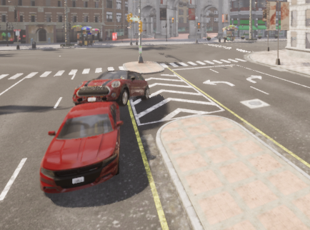

# Autonomous Car in Carla Simulator

In this repository, we will go step by step on how to create an autopilot for a car in Carla Simulator. We'll break down each step to help you understand the process. The goal is to guide the vehicle along a predefined lane, detect traffic lights and signs, and introduce weather changes within the simulator.

{ width=50% }

## Pre-requisites
#### Install Carla.
To install Carla, we will open the link https://github.com/carla-simulator/carla/blob/master/Docs/download.md and select the package that best suits our device's specifications. In my case, I have used version 9.14.

Be aware that Carla uses a significant amount of space on your device.

#### Anaconda enviroment
We will proceed to create an environment in Anaconda to have all the libraries and dependencies that we are going to use in the same recurring place.
1. Through the link https://docs.anaconda.com/free/anaconda/install/windows/, we will install Anaconda. Choose the package that best suits your device.
2. Once we have Anaconda installed, we proceed to open it. We go to the 'Environments' tab and click on 'Create'. We assign a name to our environment and select Python version 3.7.
   
   
3. Next, we will open Anaconda Prompt and activate the created environment to install all the libraries specified in notebooks/requirements.txt.
   
   
4. Finally, in Anaconda's Home, we will select our environment and install Jupyter and Spyder to be able to access the notebooks and scripts.
   
   

## Introduction

#### Carla test
Before running any code, we need to have Carla running.
To run it, we will need to open the system prompt. First, we will go to the folder where we have CarlaUE4.exe and execute it. Carla may take a moment to open.

   
   
   
We are going to run the script ".\CARLA_0.9.14\WindowsNoEditor\PythonAPI\examples\generate_traffic.py" to verify that everything is working correctly

   
   
#### First script 

In the first script (Carla_Simulator/notebooks/1_introduction.ipynb), we will see how to access the Carla world, create a car, a sensor, and save photos taken by the sensor.

## Part 3

Run the cripts nº 5, 6a and 6b to understand Carla.

## Part 2

Learn how to instruct the simulator to drive straight (Script No. 7).

## Part 3

Understand how to command the simulator to move "x" meters forward and stop (Script No. 9).

## Part 4

Implement the functionality from Part 3 without stopping (Script No. 10). Additionally, change the weather (Script No. 10a) and apply the code in a different town (Script No. 10b).

## Part 5

Create code to change lanes within the same road using "r" for right and "l" for left (Script No. 11).

## Part 6

Implement a mechanism for the vehicle to stop at red traffic lights and proceed when they turn green (Script No. 12).

## Part 7

Develop code to detect traffic signals and adjust the vehicle's behavior accordingly (Script No. 13). Additionally, create a model for classifying traffic signals (Script No. 13a, open with Colab).

## Final Part

Execute the script 'Autonomous Driving' to implement autonomous driving while detecting traffic lights and signals.

