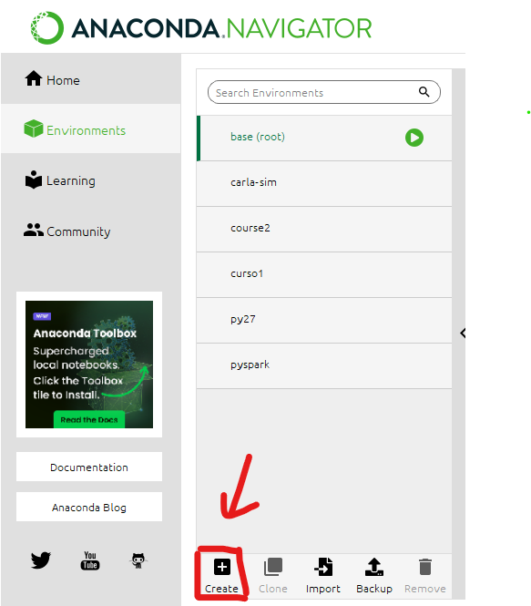

# Autonomous Car in Carla Simulator

In this repository, we will go step by step on how to create an autopilot for a car in Carla Simulator. We'll break down each step to help you understand the process. The goal is to guide the vehicle along a predefined lane, detect traffic lights and signs, and introduce weather changes within the simulator.

Fuente: https://www.iteramos.com/pregunta/89805/cambiar-el-tamano-de-la-imagen-en-markdown-en-gitlab

## Pre-requisites
#### Install Carla.
To install Carla, we will open the link https://github.com/carla-simulator/carla/blob/master/Docs/download.md and select the package that best suits our device's specifications. In my case, I have used version 9.14.

Be aware that Carla uses a significant amount of space on your device.

#### Anaconda enviroment
We will proceed to create an environment in Anaconda to have all the libraries and dependencies that we are going to use in the same recurring place.
1. Through the link https://docs.anaconda.com/free/anaconda/install/windows/, we will install Anaconda. Choose the package that best suits your device.
2. Once we have Anaconda installed, we proceed to open it. We go to the 'Environments' tab and click on 'Create'. We assign a name to our environment and select Python version 3.7.
   
   
4. Next, we will open Anaconda Prompt and activate the created environment to install all the libraries specified in notebooks/requirements.txt.
   
   
6. Finally, in Anaconda's Home, we will select our environment and install Jupyter and Spyder to be able to access the notebooks and scripts.
   
   

## Introduction

#### Carla test
Before running any code, we need to have Carla running.
To run it, we will need to open the system prompt. First, we will go to the folder where we have CarlaUE4.exe and execute it. Carla may take a moment to open.

   
   
   
We are going to run the script ".\CARLA_0.9.14\WindowsNoEditor\PythonAPI\examples\generate_traffic.py" to verify that everything is working correctly

   
   
#### First script 

In the first script (Carla_Simulator/notebooks/1_introduction.ipynb), we will see how to access the Carla world, create a car, a sensor, and save photos taken by the sensor.

## Tests with vehicles

To understand how Carla works, we are going to run two scripts. In the first one (Carla_Simulator/notebooks/2_tests_one_vehicle.ipynb), we will explore how to turn on the autopilot in one vehicle. In the second one (Carla_Simulator/notebooks/3_tests_two_vehicles.ipynb), we will learn how to create two vehicles simultaneously.

 

## Driving straight

Next, we will learn how to drive completely straight without leaving the lane and use a sensor to observe the car's route (Carla_Simulator/notebooks/4_driving_straight.ipynb).

## Waypoint introduction

In the script Carla_Simulator/notebooks/5_waypoint_introduction.ipynb, we will explore how waypoints work in Carla and how to navigate from one to another. To do this, we will implement a function that calculates the angle to go from one point to the next.

## Lane driving

We are going to implement waypoint functionality to make the car follow the lane (Carla_Simulator/notebooks/6_lane_driving.ipynb). Also in Carla_Simulator/notebooks/7_weather_change.ipynb we are going to understand how to change the weather meanwhile the car follows the lane. Finally, we will see the implementation of lane driving in a diferent Town (Carla_Simulator/notebooks/8_lane_driving_Town01.ipynb).

## Lane change 

In Carla_Simulator/notebooks/9_lane_change we will reate code to change lanes within the same road using "r" for right and "l" for left.

## Traffic lights 

We will implement a mechanism for the vehicle to stop at red traffic lights and proceed when they turn green (Carla_Simulator/notebooks/10_traffic_lights.ipynb).

## Signs

In the script (Carla_Simulator/notebooks/11_traffic_signsevelop.ipynb) we are going to devolp code to detect traffic signals and adjust the vehicle's behavior accordingly. 
Additionally, we will create a model for classifying traffic signals (Carla_Simulator/notebooks/prediction/12_algorithm1_collab.ipynb). It is recommend it to open the sript with collab.

## App
 We are going to create an app to select the desired values in our simulator like the color of the car, the model or the weather (Carla_Simulator/src/12_app.py).

## Final Part

To implement everything that we learn we are going to create a script that allows the vehicle to have an autonomous driving (Carla_Simulator/notebooks/Autonomous_driving.ipynb) (Carla_Simulator/src/Autonomous_driving.py)

